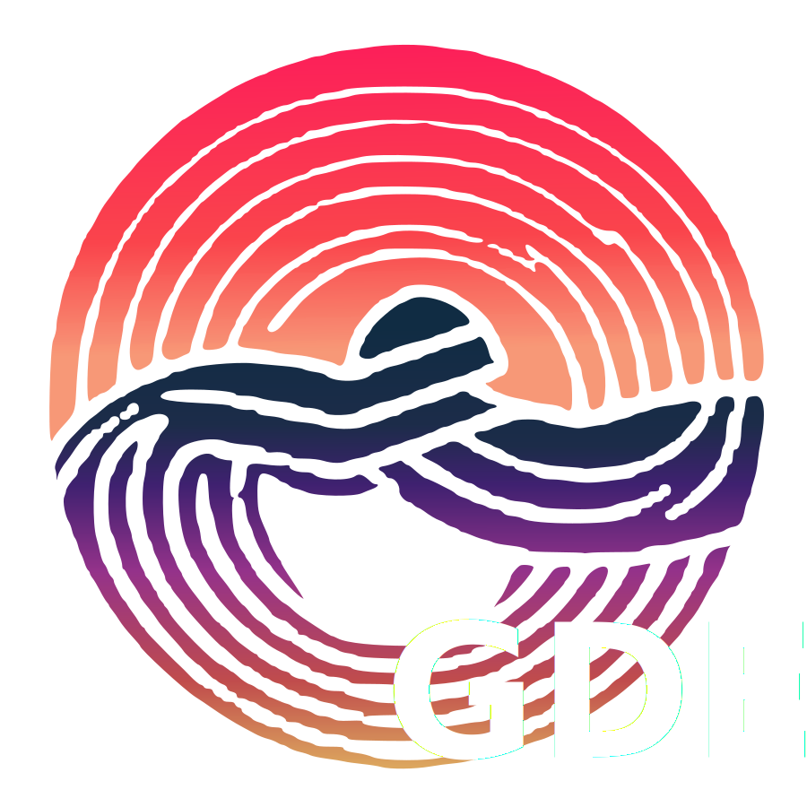

# GDE GoZen

*Video playback addon for the Godot game engine*

## What is GDE GoZen?
GDE GoZen is a GDExtension addon for the Godot game engine which provides video playback for all kinds of video formats. Godot natively only supports Theora, but with this GDExtension you'll be able to use files such as `.mp4` and more thanks to using the power of FFmpeg.

GDE GoZen is part of the [GoZen project](https://github.com/VoylinsGamedevJourney/GoZen), a video editor made with Godot! 

## Features
- Smooth video playback;
- Video seeking;
- Godot 4.3+ support;
- Cross-platform (Linux, Windows, MacOS, and Android);
- Playback speed control;
- Regular updates;

### Note
Web build is possible, but has no audio support. There is also no AV1 support, no access to system files due to Godot web builds running in a sandbox, and performance is a lower compared to the other platform support. Due to these issues, the official builds don't have web support and for that you'd better use the Godot build in Theora video playback instead.

## How to use?
Before you can use GDE GoZen in your project, you will need to compile the GDExtension. You will **need** the debug build for your current operating system, and the necessary compiled (debug and/or release) builds for the platforms you want to support.

> [!CAUTION]
> The test room project **will NOT** work without having the GDExtension compiled!

For more info about the compiling, head over to [the COMPILE_INFO manual](./COMPILE_INFO.md). For more info on how to use GDE GoZen, go to [the GDE GoZen manual](./test_room/addons/gde_gozen/README.md) which is included in the addon folder. The addon script has a lot of info as well on how to use the VideoPlayback node which comes with the addon.

### Download compiled version
If compiling the addon for your system and all the operating systems which you want to support, they are also available on [my ko-fi page](https://ko-fi.com/s/c6ec85052b) and on [itch.io](https://voylin.itch.io/gde-gozen-video-playback-addon-for-godot). Source code will always be available for free and it will stay open source, so you can compile everything yourself.

Getting the compiled builds from Itch.io or Ko-fi gives you access to new compiled builds on every new release so you won't have to compile them all manualy. Getting the compiled versions through Ko-fi or Itch.io is also one of the best way's to support the future development of this GDExtension.

## Supporting GDE GoZen

Supporting can be done through contributions to the project and through donations. For more information on how to contribute to the project, feel free to take a look at [the CONTRIBUTING manual](./.github/CONTRIBUTING.md). Financial supporting GDE GoZen and GoZen can be done through [my Ko-fi page](https://ko-fi.com/voylin)

## Projects using GDE GoZen
### Games
- [vergissmeinnicht](https://ciaokokao.itch.io/vergissmeinnicht);

### Projects
- [GoZen - video editor](https://github.com/VoylinsGamedevJourney/GoZen)

## Licensing
Please be careful and read up on the licensing requirements of both this repo and of FFmpeg when using this GDExtension. Licensing is complicated and I'm not a lawyer. As long as you don't make adjustments to the way that FFmpeg gets compiled, there should be no issue for your projects/games.

> This software uses libraries from the FFmpeg project under the LGPLv2.1

